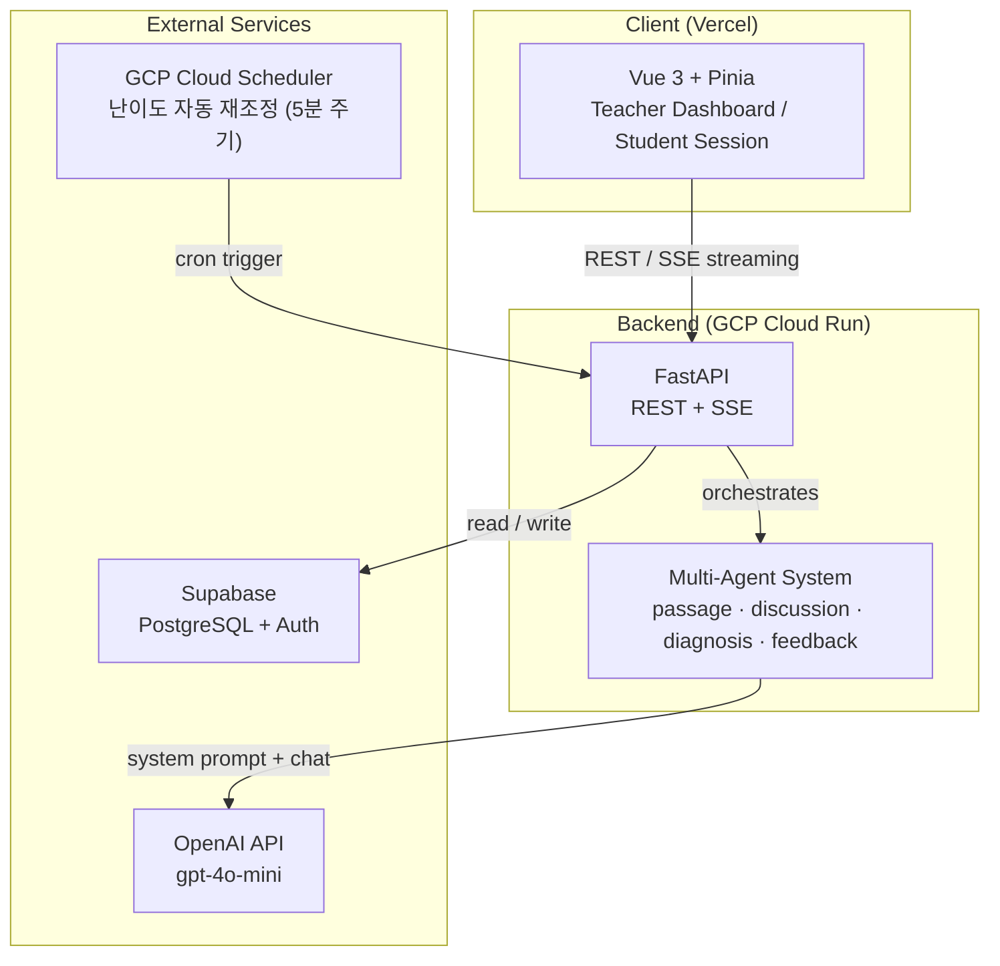

# 🧠 Tododok — 멀티에이전트 기반 초개인화 문해력 솔루션

> **한 줄 요약:** 정답 확인으로 끝나는 기존 문해력 학습의 한계를 넘어, 또래 에이전트와의 독서 토의로 초등학생의 추론·어휘·맥락 파악 능력을 실시간 진단하는 교육 플랫폼

<div align="center">


</div>

## 1. 개요

- **핵심 가치:** 또래 에이전트 그룹과의 독서 토의를 결합해 학생이 _왜_ 그렇게 생각했는지를 대화 기반으로 드러내고, 추론력·어휘력·맥락 파악 세 축으로 개인 취약 영역을 정밀 진단
- **배포 URL:** [https://liter-psi.vercel.app](https://liter-psi.vercel.app)
- **주요 기술:** `Vue 3`, `FastAPI`, `Supabase`, `OpenAI API`, `GCP Cloud Run`, `Vercel`

| 사용자                 | 목적                                       | 접속 방식                  |
| ---------------------- | ------------------------------------------ | -------------------------- |
| 학생 (초등학교 고학년) | 매일 세션 수행, 문해력 향상, streak 유지   | 교사 발급 join_code 입력   |
| 담임교사               | 학급 모니터링, 취약 영역 확인, 난이도 조정 | 이메일 OTP 회원가입·로그인 |

## 2. 핵심 문제 해결

### 🏗 Architecture



**데이터 흐름 요약**

```text
세션 시작 → 지문 읽기 → 객관식 3문항 → AI 그룹 토의 (최대 3토픽) → 세션 종료
                                                      ↓
                                        점수 저장 + streak 갱신 + 취약 영역 업데이트
```

## 3. 핵심 기능 및 트러블슈팅

### 🛠 멀티 에이전트 토의 — 인격 충돌 방지

- **상황:** 모더레이터·또래A·또래B 세 AI가 같은 API를 공유하면서 역할이 뒤섞이고, 한 에이전트가 다른 에이전트의 발언을 반복하거나 학생 차례를 침범하는 문제 발생
- **해결:** 에이전트별 system prompt를 완전히 분리(각 호출은 독립 컨텍스트), 발화 순서를 `round → speaker_turn` 배열로 백엔드가 강제 직렬화, 학생 발화 전 `또래 간 반론·동의` 반응을 필수 단계로 삽입
- **결과:** 토의 일관성 확보, 학생이 발언할 타이밍 명확화, 교사 피드백에서 "대화 흐름이 자연스럽다"는 반응

### 🛠 세션 중복 생성 방지 — Double Submit Guard

- **상황:** 네트워크 지연 상황에서 학생이 버튼을 연속 클릭하면 세션이 2개 이상 생성되어 하루 세션 한도 (3회) 가 즉시 소진되는 버그
- **해결:** 모든 async 이벤트 핸들러 첫 줄에 `if (loading.value) return` 가드 적용, Pinia store에서 `loading` 상태를 단일 소스로 관리
- **결과:** 중복 API 호출 완전 차단, UX상 버튼도 `disabled` 처리되어 학생 혼란 감소

### 🛠 동적 난이도 재조정 — 자동 레벨 갱신

- **상황:** 학생 레벨 재조정을 프론트 요청 시점에 수행하면 교사가 수동 설정한 레벨을 덮어쓸 위험이 있고, 요청 경합 발생
- **해결:** GCP Cloud Scheduler가 5분 주기로 `/internal/adjust-levels` 호출, 최근 3세션 평균 점수 기준 레벨 변경, `is_manual_override` 플래그가 `true`인 학생은 자동 조정 건너뜀
- **결과:** 교사 수동 설정 보존, 레벨 갱신 지연 최대 5분 이내로 통제

## 4. 실행 방법

### 🐳 Docker (Backend)

```bash
# 이미지 빌드
docker build -t liter-backend ./backend

# 환경 변수 주입 후 실행
docker run -p 8080:8080 \
  -e SUPABASE_URL=<your-url> \
  -e SUPABASE_SERVICE_ROLE_KEY=<key> \
  -e OPENAI_API_KEY=<key> \
  -e JWT_SECRET=<secret> \
  liter-backend
```

### 💻 Local

```bash
# ── Backend ──────────────────────────────────────────
cd backend
pip install -r requirements.txt

# .env 파일 생성 (아래 변수 필수)
# SUPABASE_URL, SUPABASE_ANON_KEY, SUPABASE_SERVICE_ROLE_KEY
# OPENAI_API_KEY, JWT_SECRET, APP_ENV=dev

uvicorn main:app --host 0.0.0.0 --port 8080 --reload

# ── Frontend ─────────────────────────────────────────
cd frontend
npm install

# .env.local 파일 생성
# VITE_API_BASE_URL=http://localhost:8080

npm run dev        # http://localhost:5173
```

**필수 환경 변수 목록**

| 변수                        | 설명                                   |
| --------------------------- | -------------------------------------- |
| `SUPABASE_URL`              | Supabase 프로젝트 URL                  |
| `SUPABASE_ANON_KEY`         | Supabase anon public key               |
| `SUPABASE_SERVICE_ROLE_KEY` | Sup`abase service role key (서버 전용) |
| `OPENAI_API_KEY`            | OpenAI API 키                          |
| `JWT_SECRET`                | JWT 서명 비밀키                        |
| `VITE_API_BASE_URL`         | 프론트에서 바라볼 백엔드 URL           |

---

## 5. 유지보수

- **CI/CD:** GitHub Actions 2개 워크플로우

  - `deploy-backend.yml` — `backend/**` 변경 → Docker 빌드 → GCP Artifact Registry push → Cloud Run 배포 (asia-northeast3)
  - `deploy-frontend.yml` — `frontend/**` 변경 → Vercel 프로덕션 배포

- **API Document:** FastAPI 자동 생성 Swagger UI — `{BACKEND_URL}/docs`

- **Test Strategy:**
  - E2E: Playwright (`frontend/e2e/`) — 학생 세션 플로우, 교사 대시보드 주요 경로
  - 단위 테스트: 현재 백엔드 에이전트 로직 수동 검증 중 (커버리지 확장 예정)
